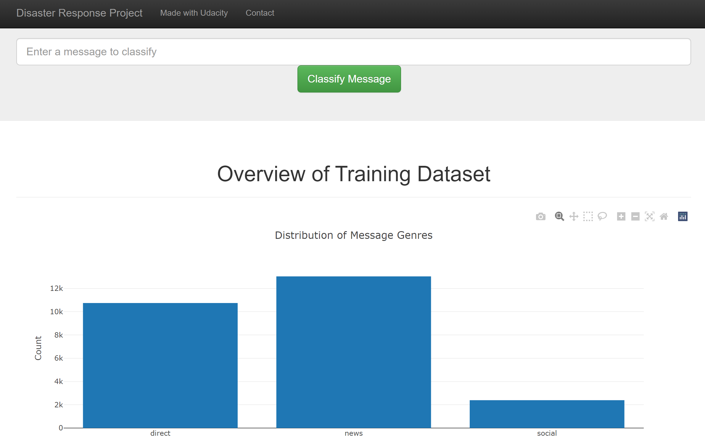
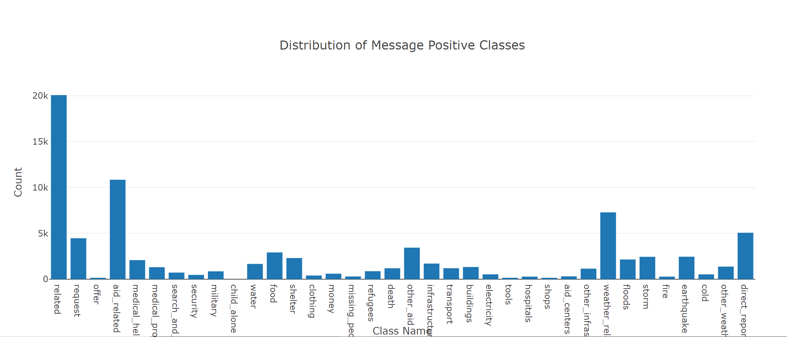

# Disaster Response Pipelines

## Contents

1. [Installation](#installation)
2. [Project Motivation](##project-motivation)
3. [File Descriptions](#file-descriptions)
4. [Results](#results)
5. [Licensing, Authors, and Acknowledgements](#Licensing,-Authors,-Acknowledgements)

## Installation

Libraries that are not already installed, can be installed using conda or pip or whatever is suitable for your platform

The libraries used are.

pandas
numpy
matplotlib
scikit-learn
plotly

[scikit-learn](https://scikit-learn.org/stable/install.html)

Note dependencies of these packages are also required but should be installed automatically by package managers.

## Project Motivation

Use message text data build a NLP application capable of classifying messages into one or more of 36 classes, according to the content of the messages.
Train 3 models and pick the best one to use in a flask web app to interactively process messages and display classification made.

## File Descriptions

Notebooks  - The Jupyter notebooks are listed below

ETL Pipeline Preparation.ipynb
ML Pipeline Preparation.pynb

data/process_data.py
model/train_classifier.py
app/Run.py

Dataset

data/disaster_categories.csv
data/disaster_messages.csv

Cleaned Data
data/disaster_response_message.db

Classifier
model/disaster_response_message_model.pkl
This file is to large for github so you will need to build your own copy using the script.

App
The app uses python and javascript Plotly APIs together to gather the plot data in the Run.py script and pass it to the javascript Ploty 
The Run.py file invokes the flask web server to serve two web pages using html templates files in the templates subfolder. go.html and master.html  The master.html provides a navigation menu and context that the go.html extends.

This is the default graph that is provided with the project.

Here is a graph that I created myself.

### Instructions:

1. Run the following commands in the project's root directory to set up your database and model.

    - To run ETL pipeline that cleans data and stores in database
        `python data/process_data.py data/disaster_messages.csv data/disaster_categories.csv data/disaster_response_message.db`
    - To run ML pipeline that trains classifier and saves
        `python models/train_classifier.py data/disaster_response_message.db models/disaster_response_message_model.pkl`

2. Run the following command in the app's directory to run your web app.
    `python run.py`

3. Go to <http://0.0.0.0:3001/>
    This may work better if you change the host address to 127.0.0.1 in the Run.py file and use the URL <http://127.0.0.1:3001/>

## Results

The flask App runs and displays the classes associated with the message than the user inputs. Plotly graphs of the message dataset are displayed on the webpage.

## Licensing, Authors, Acknowledgements

This work is licensed under a [Creative Commons Attribution 4.0 International License](http://creativecommons.org/licenses/by/4.0/)

The Disaster Response Message Dataset is provided by Figure Eight

Graphs by [Plotly] (https://plotly.com/)
